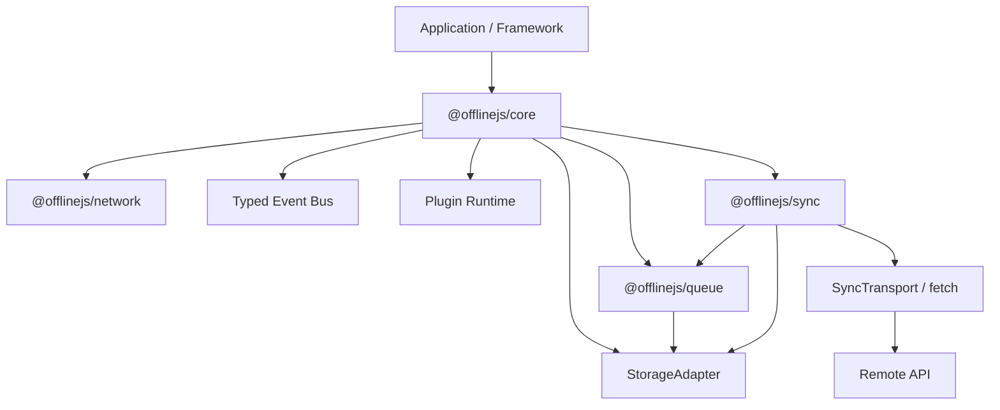
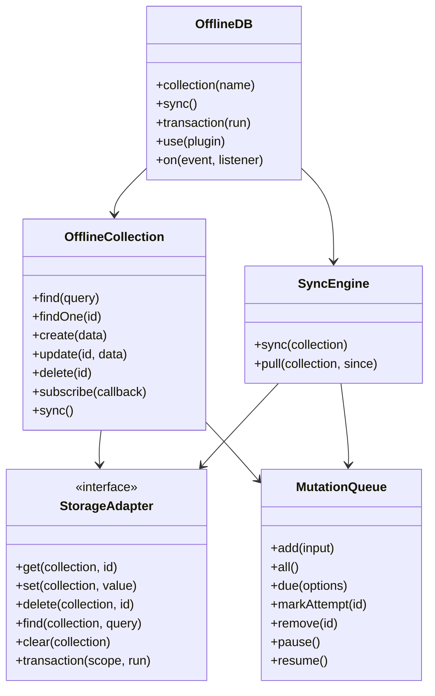

# OfflineJS

OfflineJS is a production-grade offline-first data layer for TypeScript and JavaScript.
The flagship package is `@offlinejs/core`, a framework-agnostic client that hides network
detection, local persistence, optimistic updates, mutation queues, retries, sync, and conflict
resolution behind a small collection API.

```ts
import { createOfflineDB } from "@offlinejs/core";
import { createIndexedDBStorage } from "@offlinejs/storage-indexeddb";

type AppData = {
  users: { id: string; name: string; age?: number; updatedAt?: number };
};

const db = createOfflineDB<AppData>({
  baseURL: "https://api.example.com",
  storage: createIndexedDBStorage(),
  sync: {
    conflictStrategy: "lastWriteWins"
  }
});

const users = db.collection("users");

await users.create({ name: "John" });
await users.update("user_1", { age: 25 });
await users.delete("user_1");

const data = await users.find({
  filters: { age: { gte: 18 } },
  orderBy: "name",
  sort: "asc"
});
```

## Installation

```bash
pnpm add @offlinejs/core @offlinejs/storage-indexeddb
```

For tests, SSR, workers, or ephemeral data:

```bash
pnpm add @offlinejs/core @offlinejs/storage-memory
```

## Usage examples

### Browser app with IndexedDB

Use IndexedDB for durable browser storage. Writes update local state first, then sync when the
network is available.

```ts
import { createOfflineDB } from "@offlinejs/core";
import { createIndexedDBStorage } from "@offlinejs/storage-indexeddb";

type AppData = {
  todos: {
    id: string;
    title: string;
    completed: boolean;
    createdAt?: number;
    updatedAt?: number;
  };
};

const db = createOfflineDB<AppData>({
  baseURL: "https://api.example.com",
  storage: createIndexedDBStorage({ databaseName: "my-app" }),
  sync: {
    autoStart: true,
    conflictStrategy: "lastWriteWins"
  }
});

const todos = db.collection("todos");

const todo = await todos.create({
  title: "Draft offline-first docs",
  completed: false
});

await todos.update(todo.id, { completed: true });

const openTodos = await todos.find({
  filters: { completed: false },
  orderBy: "createdAt",
  sort: "desc"
});
```

### Node.js, tests, or SSR with memory storage

Use memory storage when persistence is not required or when running unit tests.

```ts
import { createOfflineDB } from "@offlinejs/core";
import { createMemoryStorage } from "@offlinejs/storage-memory";

type TestData = {
  users: {
    id: string;
    name: string;
    role?: "admin" | "member";
  };
};

const db = createOfflineDB<TestData>({
  storage: createMemoryStorage(),
  sync: { enabled: false }
});

const users = db.collection("users");

await users.create({ name: "Ada", role: "admin" });

const admins = await users.find({
  filters: { role: "admin" },
  search: "ada"
});
```

### Subscribe to local changes

Subscriptions are notified after local writes and collection sync.

```ts
const unsubscribe = users.subscribe((records) => {
  console.log("Local users changed", records);
});

await users.create({ name: "Grace" });

unsubscribe();
```

### Listen for sync and queue events

Use events for status indicators, telemetry, and error reporting.

```ts
db.on("offline", () => {
  console.log("You are offline. Changes will be queued.");
});

db.on("online", () => {
  console.log("Back online. Sync will resume.");
});

db.on("queue:add", (mutation) => {
  console.log("Queued mutation", mutation.operation, mutation.collection);
});

db.on("sync:end", ({ completed, failed }) => {
  console.log(`Sync complete: ${completed} completed, ${failed} failed`);
});

db.on("error", (error) => {
  console.error("OfflineJS error", error);
});
```

### Add a plugin

Plugins receive the database, events, network monitor, and storage adapter. They can return a
cleanup function.

```ts
const logger = () => ({
  name: "logger",
  setup({ events }) {
    return events.on("sync:start", ({ queued }) => {
      console.debug(`Starting sync for ${queued} queued mutations`);
    });
  }
});

db.use(logger());
```

### Use a custom transport

Use `transport` when your API does not follow the default fetch conventions.

```ts
import type { SyncTransport } from "@offlinejs/core";

const transport: SyncTransport = {
  async request(request) {
    const response = await fetch(`/api/offline${request.path}`, {
      method: request.method,
      headers: request.headers,
      body: request.body ? JSON.stringify(request.body) : undefined
    });

    return {
      data: await response.json(),
      status: response.status
    };
  }
};

const db = createOfflineDB({
  storage: createIndexedDBStorage(),
  transport
});
```

## Package architecture

| Package                        | Why it exists                                                                                                 |
| ------------------------------ | ------------------------------------------------------------------------------------------------------------- |
| `@offlinejs/core`              | Public database API, collections, optimistic writes, events, plugins, typed errors, and orchestration.        |
| `@offlinejs/types`             | Shared contracts for adapters, sync, queues, plugins, and framework integrations.                             |
| `@offlinejs/utils`             | Tree-shakable helpers for IDs, query matching, sorting, pagination, search, backoff, and error normalization. |
| `@offlinejs/storage-memory`    | Fast in-memory adapter for Node.js, tests, SSR fallbacks, and demos.                                          |
| `@offlinejs/storage-indexeddb` | Durable browser storage adapter built on IndexedDB with collection indexing.                                  |
| `@offlinejs/storage-sqlite`    | SQLite adapter over a pluggable async SQL driver for mobile, Electron, server, and edge runtimes.             |
| `@offlinejs/storage-opfs`      | Origin Private File System adapter for large browser datasets.                                                |
| `@offlinejs/queue`             | Persistent mutation queue with priority, retries, pause/resume, and batch selection.                          |
| `@offlinejs/network`           | Browser/Node-safe network monitor and fetch transport.                                                        |
| `@offlinejs/sync`              | Push, pull, delta-ready sync engine and conflict resolution strategies.                                       |
| `@offlinejs/sync-protocol`     | Reference push/pull sync protocol envelopes and server handlers.                                              |
| `@offlinejs/react`             | React hooks built on `useSyncExternalStore`.                                                                  |
| `@offlinejs/next`              | Optional Next.js helpers for runtime-aware clients, cache tags, and server-action sync.                       |
| `@offlinejs/devtools`          | Plugin for inspecting OfflineJS events during development.                                                    |
| `@offlinejs/devtools-ui`       | Framework-free devtools event timeline renderer.                                                              |
| `@offlinejs/service-worker`    | Service Worker background sync plugin and worker handler helpers.                                             |
| `@offlinejs/worker-sync`       | Worker-based sync runtime helpers.                                                                            |
| `@offlinejs/coordination`      | Multi-tab coordination over BroadcastChannel.                                                                 |
| `@offlinejs/conflicts`         | CRDT-friendly conflict resolver helpers.                                                                      |
| `@offlinejs/validation`        | Schema validation helpers and validated storage wrapper.                                                      |
| `@offlinejs/encryption`        | JSON encryption storage wrapper and WebCrypto codec factory.                                                  |
| `@offlinejs/auth`              | Auth transport wrapper and plugin patterns.                                                                   |
| `@offlinejs/benchmarks`        | Benchmark utilities for 100k+ record adapter checks.                                                          |
| `examples/*`                   | Runnable examples demonstrating package composition.                                                          |

## Folder structure

```txt
packages/
  core/
  storage-indexeddb/
  storage-memory/
  storage-opfs/
  storage-sqlite/
  sync/
  sync-protocol/
  network/
  queue/
  types/
  utils/
  react/
  next/
  devtools/
  devtools-ui/
  service-worker/
  worker-sync/
  coordination/
  conflicts/
  validation/
  encryption/
  auth/
  benchmarks/
examples/
  basic-node/
docs/
  api-reference.md
  architecture.md
  best-practices.md
  faq.md
  plugins.md
  roadmap-implementation.md
  storage-adapters.md
  sync-engine.md
```

## Public API

```ts
const db = createOfflineDB({
  baseURL,
  storage,
  sync,
  plugins
});

const users = db.collection("users");

await users.find();
await users.findOne(id);
await users.create(data);
await users.update(id, data);
await users.delete(id);
await users.sync();
users.subscribe((records) => {});

db.on("sync:start", ({ queued }) => {});
db.on("sync:end", ({ completed, failed }) => {});
db.on("offline", (state) => {});
db.on("online", (state) => {});
db.on("queue:add", (mutation) => {});
db.on("queue:complete", (mutation) => {});
db.on("conflict", (context) => {});
db.on("error", (error) => {});
```

## High-level architecture



## Class diagram



## Storage adapter design

```ts
interface StorageAdapter {
  get<TRecord>(collection: string, id: string): Promise<TRecord | null>;
  set<TRecord>(collection: string, value: TRecord): Promise<void>;
  delete(collection: string, id: string): Promise<void>;
  find<TRecord>(collection: string, query?: QueryOptions<TRecord>): Promise<TRecord[]>;
  clear(collection?: string): Promise<void>;
  transaction<TValue>(
    scope: string[],
    run: (store: TransactionStore) => Promise<TValue>
  ): Promise<TValue>;
}
```

Current adapters:

- IndexedDB for durable browser persistence.
- Memory for Node.js, tests, SSR fallbacks, and short-lived workers.

Future adapters:

- SQLite for mobile, Electron, and server runtimes.
- OPFS for browser file-backed datasets.
- LocalStorage for tiny datasets and legacy environments.

## Sync engine design

```txt
Offline
  -> optimistic local write
  -> persistent queue
  -> reconnect
  -> batch due mutations
  -> push sync
  -> conflict resolution
  -> pull/delta sync
  -> remove completed queue items
```

Supported sync modes:

- Push sync: queued local mutations are sent to the server.
- Pull sync: server records are written into local storage.
- Delta sync: `since` values can be passed to `pull()` and API query params.
- Incremental sync: collection-level `sync()` limits work to a single collection.

## Queue implementation

Queued mutations include operation, collection, record id, payload, base snapshot, priority,
retry count, last attempt timestamp, and status. The queue is storage-backed, so it survives
refreshes when paired with IndexedDB. Processing selects due mutations by priority and creation
time, applies exponential backoff with jitter, and removes mutations only after success.

## Conflict resolution

Built-in strategies:

- `clientWins`
- `serverWins`
- `lastWriteWins`
- `merge`
- custom async resolver

```ts
const db = createOfflineDB({
  sync: {
    conflictStrategy: async ({ client, server }) => ({
      ...server,
      ...client,
      reviewed: true
    })
  }
});
```

## Plugin system

Plugins receive the database, event bus, network monitor, and storage adapter. They can subscribe
to lifecycle events, decorate behavior externally, and return a disposer.

```ts
const logger = () => ({
  name: "logger",
  setup({ events }) {
    return events.on("error", (error) => console.error(error));
  }
});

db.use(logger());
```

Use plugins for auth headers, encryption, analytics, logging, schema validation, and devtools.

## Error handling

`@offlinejs/core` exports:

- `OfflineError`
- `ConflictError`
- `StorageError`
- `SyncError`
- `ValidationError`

Exceptions are surfaced through rejected promises and the `error` event. Sync failures never delete
queued mutations; they are retried according to queue policy.

## Performance strategy

- Storage adapters own persistence and can add native indexes.
- Querying supports pagination, filtering, sorting, and search at the adapter boundary.
- Sync uses batches to avoid long main-thread work and oversized network requests.
- Queue backoff avoids hot retry loops when APIs are unavailable.
- Collections notify subscribers only after local writes or collection sync.
- Packages are ESM, side-effect free, and tree-shakable.
- Large datasets should use indexed adapters, server-side delta sync, and small `limit` windows.

## Testing strategy

Vitest covers:

- offline optimistic writes
- reconnect sync
- retries and queue preservation
- conflict strategy behavior
- memory storage
- collection subscriptions
- pagination, filtering, sorting, and search

The repository is configured for coverage reporting with a 90%+ target as packages mature.

## Internal implementation plan

1. Keep public contracts in `@offlinejs/types`.
2. Keep framework-independent behavior in core packages.
3. Add adapters without changing `@offlinejs/core`.
4. Add framework packages as optional peer integrations.
5. Add advanced production features behind stable interfaces: schema validation, encryption,
   worker-based sync, service-worker background sync, and adapter-specific indexes.

## Roadmap

### v0.1

- Built: Core collection API.
- Built: Memory and IndexedDB adapters.
- Built: Persistent mutation queue.
- Built: Push/pull sync engine.
- Built: Events, subscriptions, plugins, typed errors.
- Built: Foundational documentation and tests.

### v0.2

- Built: Service Worker background sync plugin in `@offlinejs/service-worker`.
- Built: Adapter-level secondary-index metadata in memory and IndexedDB adapters.
- Built: Richer fetch transport configuration with middleware and timeout support.
- Built: First React hooks built on `useSyncExternalStore` in `@offlinejs/react`.

### v0.3

- Built: Schema validation helpers and validated storage wrapper in `@offlinejs/validation`.
- Built: Encryption storage wrapper and WebCrypto AES-GCM codec factory in `@offlinejs/encryption`.
- Built: Auth transport wrapper and plugin patterns in `@offlinejs/auth`.
- Built: Next.js cache tag and server-action sync helpers in `@offlinejs/next`.

### v0.5

- Built: SQLite adapter over a pluggable async SQL driver in `@offlinejs/storage-sqlite`.
- Built: OPFS adapter in `@offlinejs/storage-opfs`.
- Built: Worker-based sync runtime helpers in `@offlinejs/worker-sync`.
- Built: Framework-free devtools UI package in `@offlinejs/devtools-ui`.

### v0.8

- Built: Multi-tab coordination in `@offlinejs/coordination`.
- Built: CRDT-friendly conflict resolver helpers in `@offlinejs/conflicts`.
- Built: Server sync protocol reference implementation in `@offlinejs/sync-protocol`.
- Built: Performance benchmark utilities for 100k+ records in `@offlinejs/benchmarks`.

### v1.0

- In progress: Stable public contracts.
- In progress: Backwards-compatible adapter API.
- In progress: Full docs site.
- In progress: 90%+ coverage across core packages.
- In progress: Production hardening for large datasets, migrations, and background sync.
